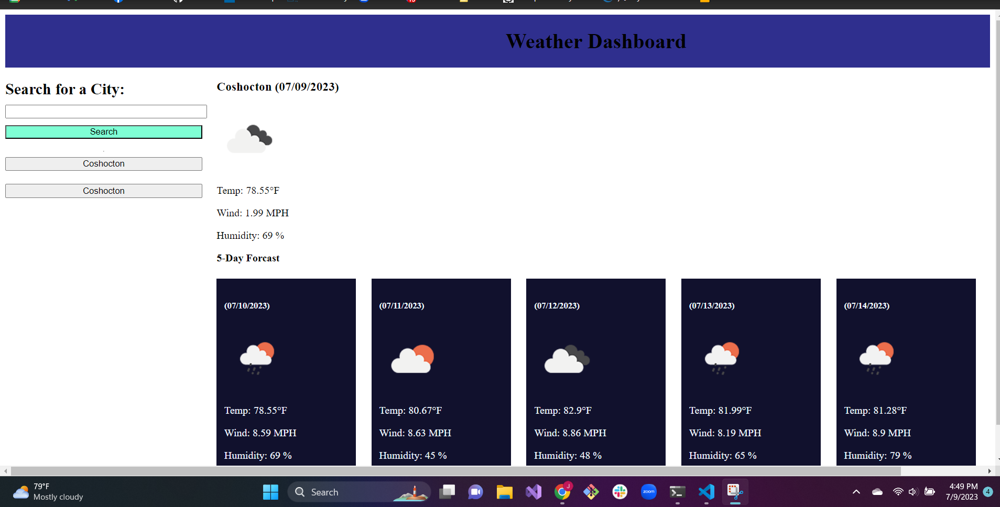

# Weather Dashboard

## Description
A simple app that provides a 5 day forcast for whatver city the user searches and saves previous serches to their local history

## Usage
To use all you need to do is insert a valid API key for open weather and then search a city. Information on the current and future weather will be provided and you can use the saved searches to the left to quickly navigate cities that you have searched before. 

## Credits
Alex Nguyen for help getting API to work